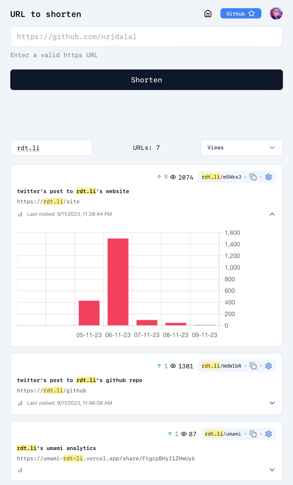

<a href="https://nextjs.org">
  <h1 align="center">
   <a href="https://rdt.li/site" tardet="_blank">
    Redirect.link
   </a>
   URL Shortener
  </h1>
</a>


<p align="center">
  <a href="https://rdt.li/site" tardet="_blank">Redirect.link</a> self hostable, feature rich, minimalistic and open source URL shortener. Built with Next.js, Drizzle, NextAuth and Postgres.
</p>

- No reloads: it's 2023, we hate reloads
- Analytics: All time, daily and unique views
- Bar Charts: Last 7 days views charted
- Editable: Edit titles, URLs and destinations easily
- Filters: Filter by create, views and more
- Search: Search for URLs with syntax highlighting
- Theme: Light (default) and dark mode

<p align="center"><a href="https://rdt.li/site" tardet="_blank">Try now</a> or <a href="#one-click-deploy">self host</a> it.</p>

<p align="center">
  <a href="https://rdt.li/x-nrjdalal">
    
  </a>
</p>

<p align="center">
  <a href="#features"><strong>Features</strong></a> ·
  <a href="#self-host"><strong>Self Host</strong></a> ·
  <a href="#one-click-deploy"><strong>Deploy</strong></a> ·
  <a href="#local-development"><strong>Development</strong></a> ·
  <a href="#roadmap"><strong>Roadmap</strong></a> ·
  <a href="#author"><strong>Author</strong></a> ·
  <a href="#credits"><strong>Credits</strong></a>
</p>

<br/>

<p align="center">
  <a href="https://rdt.li/site" target="_black">
    
  </a>
</p>

<p align="center">
  <a href="https://rdt.li/site" target="_black">
    
  </a>
</p>

<!-- <p align="center">
  <a href="https://rdt.li/site" target="_black">
    
  </a>
</p> -->

<!-- About: An open source Next.js bare starter with step-by-step instructions if required. Built with Next.js 14, Drizzle (Postgres), NextAuth/Auth.js. -->
<!-- Keywords: drizzle neondb nextauthjs nextjs postgres shadcn tailwindcss typescript vercel -->

## Features

Built on top of [Onset](https://onset.vercel.app) a Next.js starter that comes with step-by-step instructions to understand how everything works, easy for both beginners and experts alike and giving you the confidence to customize it to your needs. Built with Next.js 14, Drizzle (Postgres), NextAuth/Auth.js.

### Frameworks

- [Next.js](https://nextjs.org/) – React framework for building performant apps with the best developer experience
- [Auth.js](https://authjs.dev/) – Handle user authentication with ease with providers like Google, Twitter, GitHub, etc.
- [Drizzle](https://orm.drizzle.team/) – Typescript-first ORM for Node.js

### Platforms

- [Vercel](https://vercel.com/) – Easily preview & deploy changes with git
- [Neon](https://neon.tech/) – The fully managed serverless Postgres with a generous free tier

## Self Host

Below are the steps to self host this project or run it locally.
If you need any help, feel free to reach out to me on [Twitter](https://twitter.com/x-nrjdalal) or [Email](mailto:rdt.li@nrjdalal.com).

### One Click Deploy

[](https://vercel.com/new/clone?repository-url=https%3A%2F%2Fgithub.com%2Fnrjdalal%2Frdt-li&env=NEXT_PUBLIC_APP_URL,POSTGRES_URL,NEXTAUTH_SECRET,GOOGLE_CLIENT_ID,GOOGLE_CLIENT_SECRET&project-name=rdt-li-by-nrjdalal&repository-name=rdt-li-by-nrjdalal)

### Local Development

Clone & create this repo locally with the following command:

> Note: You can use `npx` or `pnpx` as well

```sh
bunx create-next-app rdt-li --example "https://github.com/nrjdalal/rdt-li"
```

1. Copy `.env.example` to `.env.local` and update the variables.

```sh
cp .env.example .env.local
```

2. Install dependencies using bun:

```sh
bun install
```

3. Start the development server:

```sh
bun dev
```

## Roadmap

- [ ] More features and points to be added

## Author

Created by [@nrjdalal](https://twitter.com/x-nrjdalal)  in 2023, released under the [MIT license](https://github.com/nrjdalal/onset/blob/main/LICENSE.md).

## Credits

This project is inspired by [@shadcn](https://twitter.com/shadcn)'s [Taxonomy](https://github.com/shadcn-ui/taxonomy).

[](https://vercel.com)
